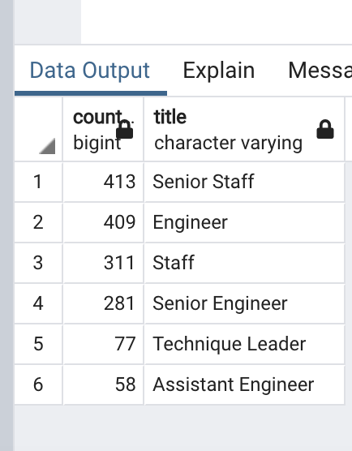
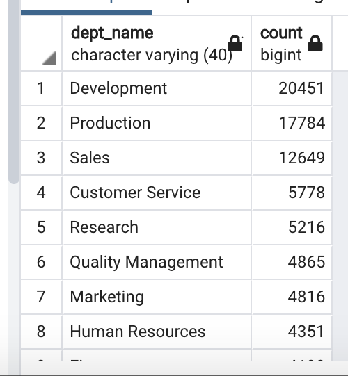
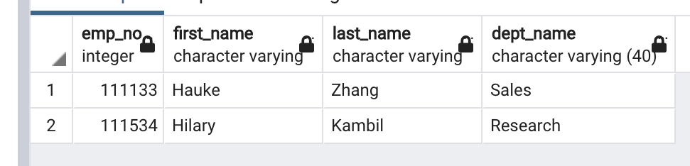

# Pewlett-Hackard-Analysis

## Overview of the analysis: 
Pewlett-Hackard is a huge company with severeal thousands of employees and it's been around for a long time. As the baby boomer generation begins to retire at rapid rate, the company is preparing itself by doing two things: 1. it's offering a retirement package for those who meet certain criteria; 2. it's starting to think about which positions will need to be filled in a near future. 

The number of upcoming retirements will open up thousand of job openings. Bobby, a HR analyst for the company, is tasked to perform employee research. First, he needs to find out who will be retiring in the next few years. And next, he needs to know how many positions will the company have to fill. 

For this specific project, I'm going to be helping Bobby to determine the number of retiring employees per title, and identify employees who are eligible to participate in a mentorship program.

## Results & Summary:

### Fig #1: Number of Retirees by Title

The table indicates that there will be a great need to hire more engineers at the same or similar level of experience or promote the junior engineers internally since almost 26,000 senior engineers are retiring. Also, since there will be 10,000 engineers retiring (9,285 engineers and 1,090 assistance engineers), the company will definitely have to alert the HR department that they will need to reach outwardly to recruit talents in that regard.

### Fig #2: Number of Eligible Mentors by Title

I ran a new query to see how many mentors will be available per title and the screenshot is what I've acquired. From these numbers, it's concerning to find out that there is a very small number of mentors available for the senior engineer position. Here we have 281 senior engineers who will be eligible for mentoring the new senior engineers. Hypothetically, each of them will have to mentor about 92 candidates (25,916/281 = 92.2) which is quite overwhelming. This is only IF all of the retirees are willing to step up and mentor otherwise the ratio would get even staggering. The HR department would have to notify each department that they need to make some preparations accordingly. Perhaps they could have the retirees write out some sort of documentation on their job descriptions so that they won't have to face the situation as explained above.
 
### Fig #3: Number of Retirees by department

I ran a query to get the count of retirees per department number and then another query to replace department number with department name for the ease of reading the consolidated data. By simply looking at the output, it's no secret that there are no departments that don't need extensive amount of recruiting. Relatively speaking, however, Development, Production, and Sales department are the ones that are in a serious need. From Fig #1, we were able to deduce that a lot of (senior/assitance) engineers will retire and it aligns with the finding here as well since it's very likely that they work for the Development and Production department. As mentioned in the previous section, these departments will probably have to take actions soon so that they can transition into the next phase as smoothly as possible after the "silver tsunami".

### Fig #4: Retiring managers and their department

I ran a query to join `unique_titles`, `dept_employee`, and `departments` to find out who are the two managers retiring from `Fig #1` and the screenshot shows their employee number, name, and their department name. Since managers are those who manage employees, I thought it's important to find out what department they work for and advise the HR department to alert those departments (Sales and Research) that they probably have to make some internal adjustments early on.  